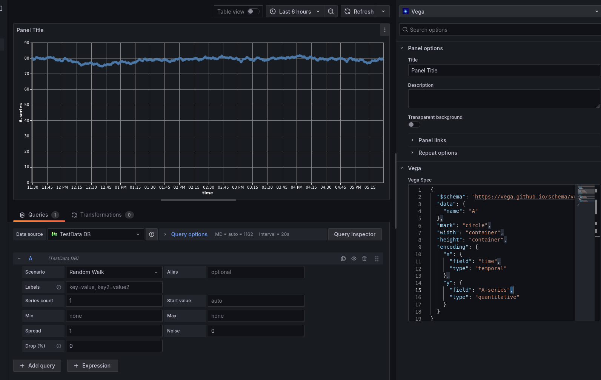
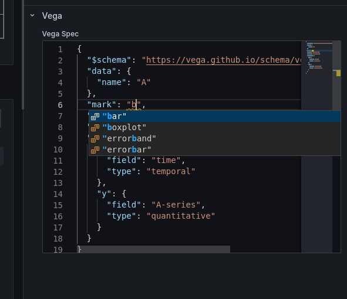
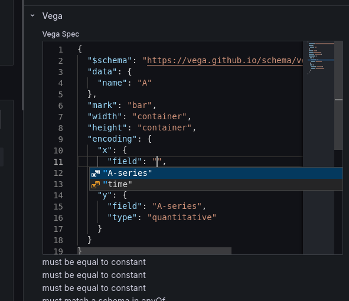
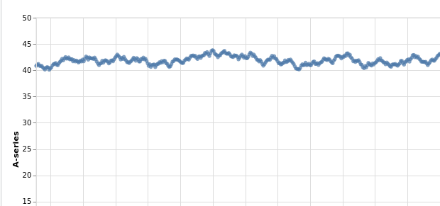

# Grafana-Vega

This is a panel plugin for Grafana that allows you to configure
Vega or Vega-Lite specs.

## Features
 - The ability to write Vega/Vega Lite specs, which are much
   more powerful than the inbuilt Grafana vizes. ([Gallery](https://vega.github.io/vega-lite/examples/)). <3 Vega.

 - A JSON editor with the Vega specs hooked up to it for autocomplete
   

 - Field names and Datasource names also hooked up to autocomplete
   

 - Automatic light/dark mode as per your Grafana theme
   

 - An obsessive amount of mucking about with React to stop your spec being reparsed all the time

 - `{"width": "container"}` hooked up to work like you want

## Todo

 - Rig up Edit in Vega Editor and the other things you expect from Vega Embed

 - Dig into if it's possible to cope when Grafana sends us multiple dataframes with the same name/refId

 - Get it signed

## Acknowledgements

 - The Vega project, you guys rock.

 - Sam Schick's prior art doing the same thing, https://github.com/schicks/vega-grafana

 - Gapit's generic HTML plugin, https://grafana.com/grafana/plugins/gapit-htmlgraphics-panel/ ,  which I used as a reference to get the nice editor working, and additionally for letting Vega panels be used in a pinch before I wrote this!
